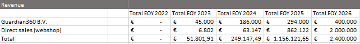

# Investment opportunities

G360DAO will offer two investment possibilities. NFT investment and regular investment. The return on investment varies per investment type.

### NFT Investment

The NFTs will have both a financial as a non-financial component. There will be a wide range of NFTs available with various prices and connected privileges, ranging from goodies to meet the founders and a seat as advisor. In total 10.000 NFT will be minted of which approximately 100 will have a special status. An overview of NFTs can be found on the [Mirror.xyz page of G360DAO](https://mirror.xyz/guardian360dao.eth/ANtQJ1DooE1qBeMZ44qZ3WUTw\_bhVPjJ5k9ci52YkM4). The financial setup of the NFTs will be that, as soon as G360DAO will create a positive revenue stream, the NFT holders will be paid 10-30% of the revenue stream until the initial purchase price + 10-30% of the initial purchase price has been repaid, creating a lifetime ROI of 10-30%.

[Subscribe to the G360DAO NFT waiting list!](https://guardian360.activehosted.com/f/85)

### Regular investment

Regular investors will initially receive 20% to 25% of the revenue stream created by G360DAO once G360DAO will have a positive revenue stream. Based on the investment, the investor will get investment tokens, which will, besides a possible financial revenue, will also grant the holders voting right in the DAO. The investment token holders (ex Guardian 360 BV) will jointly represent 30% of the total voting power in the DAO. The total amount of tokens to be minted will be 100.000.000. Out of this total, 10.000.000 will be allocated to the founders ([Guardian360 BV](https://www.guardian360.net)) and 5.00.000 for the first investors. Until 2025, the token sale plan looks as follows:

2022 – 200.000 tokens will be sold at 30% discount\
2023 – 1.400.000 tokens at 15% discount\
2024 – 1.600.000 tokens at 5% discount\
2025 – 1.800.000 tokens\
&#x20;\
The nominal sales price of the token will be €1,- per token.

<figure><figcaption>
Distribution of investment tokens
</figcaption></figure>

The scheduled investment scheme is expected to be as follows:

<figure><figcaption>
Expected Costs and Revenues – 2022 – 2025
</figcaption></figure>

The expected costs are split up in various categories. The main costs of 2022 will consist of the setup of the G360DAO. The main costs in the follow on years are made up of the development of the information security insight applications, which will be the primary product for revenue generation of G360DAO. A detailed overview of the costs can be seen below.

<figure><figcaption>
Overview of costs
</figcaption></figure>

The investments raised by the token and NFT sales will be mainly used, as shown above, on information security insight application development.

The projected revenues are built up out of two main components. The focus of G360DAO will be to provide B2B services, selling the security insights both as a service and one-off development to security platform providers or to companies who want to incorporate information security insight applications into their own IT systems. There is a launching customer revenue stream from Guardian360 BV, right as of 2023, for whom the DAO will develop information security insight applications. In 2023, the DAO will create a webshop where other customers can purchase the information security insight applications as well. Although a 600% growth of revenue stream from Guardian360 BV is projected over the period 2023-2025, the main growth of revenue will have to come from sales to other security platform providers. A projection is shown below.

<figure><figcaption>
Projection
</figcaption></figure>

### Revenue sharing

The investment and other token holders will be granted a share of the revenue, not just the profit. The revenue of G360DAO will be spread over 6 groups, the direct contributors of the DAO (DRev and other Rev share token holders, [see the G360DAO whitepaper for more information](https://app.gitbook.com/o/2YkrRUxPFdNDfr8LQAiG/s/hmXrG47OL0trMvj7QZzb/)), the investors (regular and NFT) and the treasury of the DAO. Projected revenue sharing already starts in 2023 and will grow steadily over the years. Details of the anticipated revenue sharing per group per year is displayed below.

<figure><figcaption>
Anticipated revenue sharing per group per year
</figcaption></figure>

The repayment on NFTs is displayed as an average as the exact amount of repayment depends on the type of NFT that is bought. The revenue split per group will be set until 2025, afterwards, the token holders of the DAO can jointly decide to alter the division percentages based on their voting power ([see the G360DAO whitepaper for more information on governance](https://app.gitbook.com/o/2YkrRUxPFdNDfr8LQAiG/s/hmXrG47OL0trMvj7QZzb/). NFT holders will not have voting power in the DAO).

**Know your customer - screening**

In order to be eligible for investment (both as regular investor of for NFTs), a Know Your Customer (KYC) screening will be mandatory for regulatory reasons. Once you cleared the KYC, you will be whitelisted and you can receive the tokens (investment or NFTs) bought.
